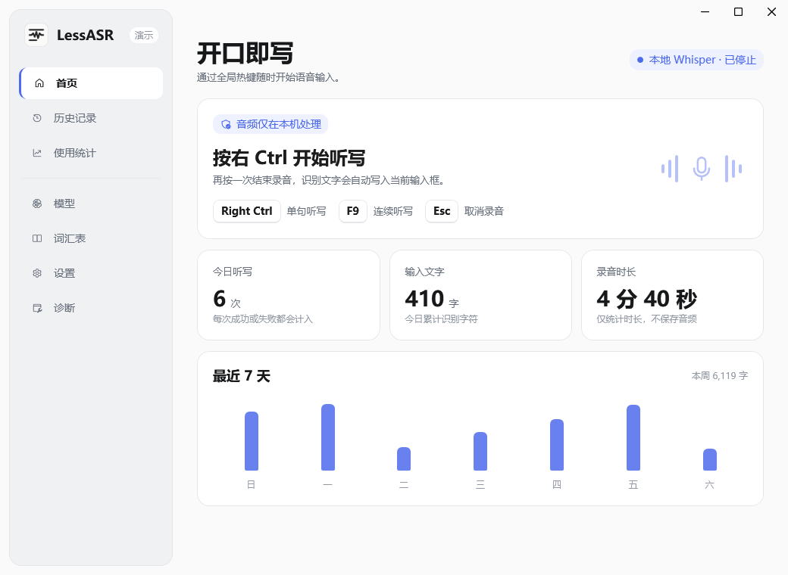
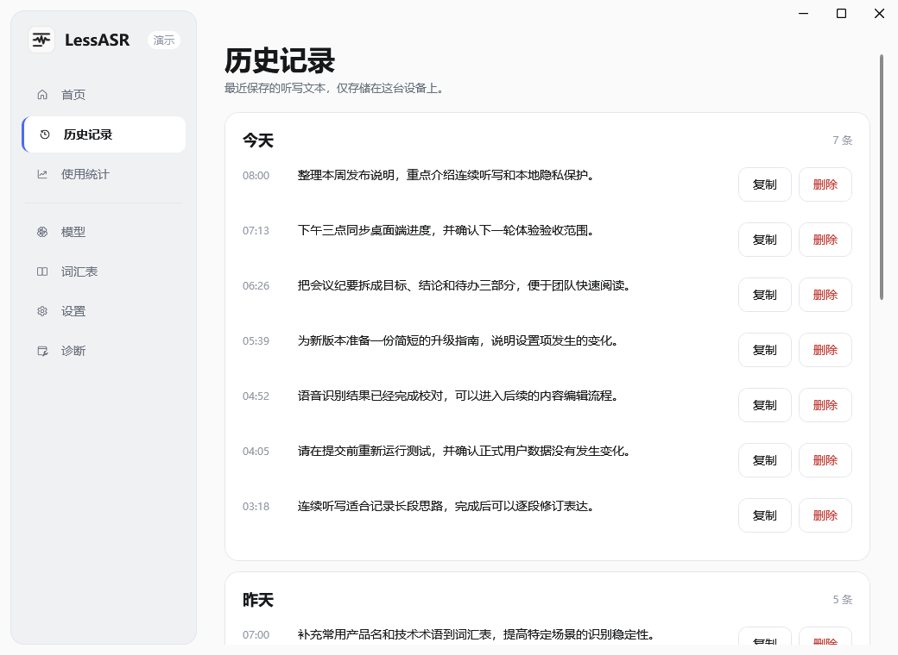
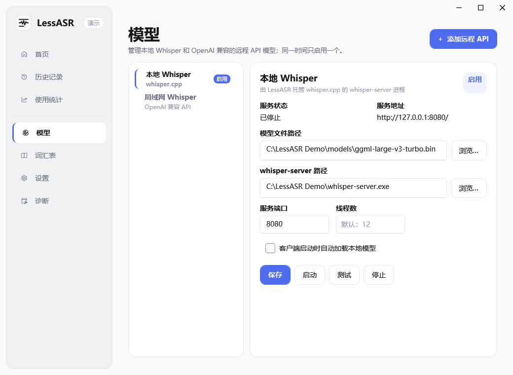
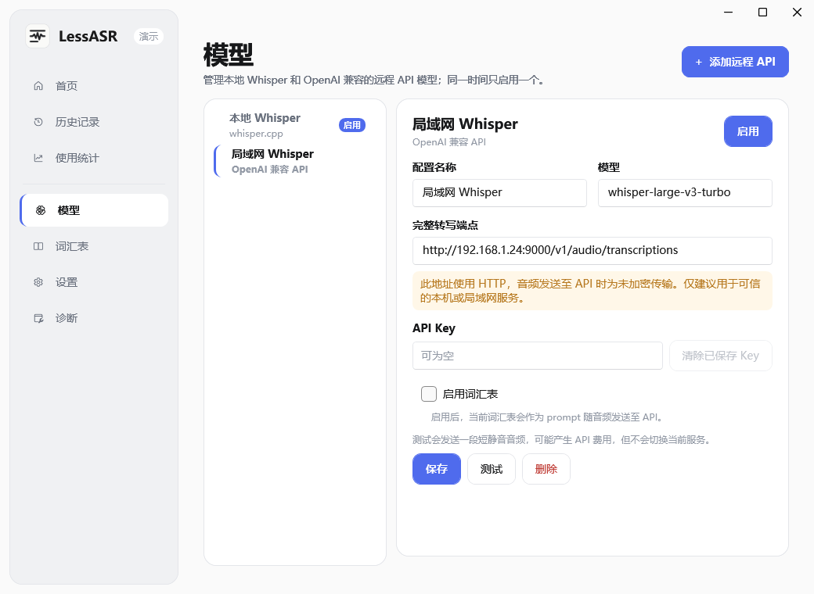
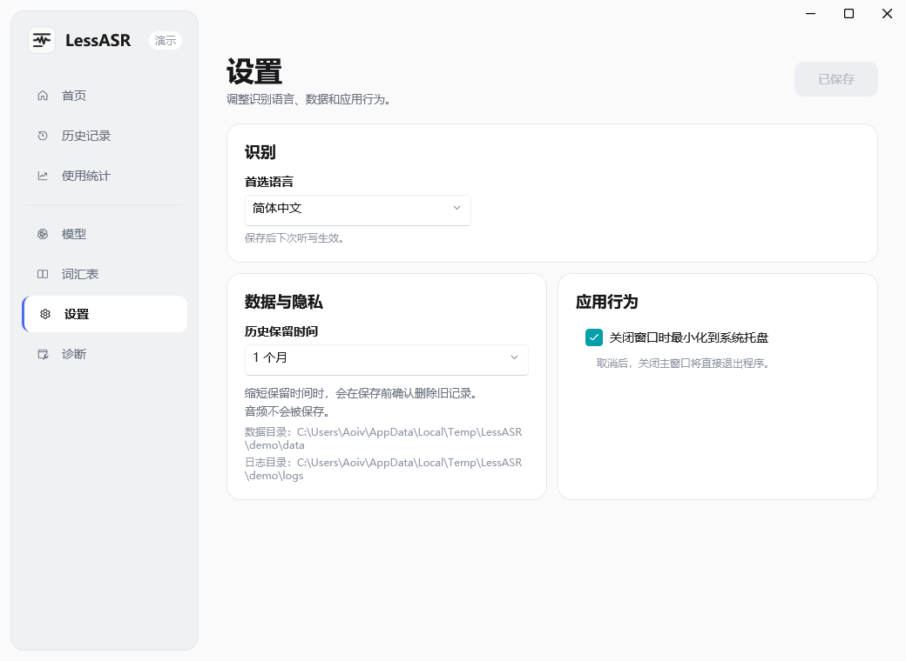
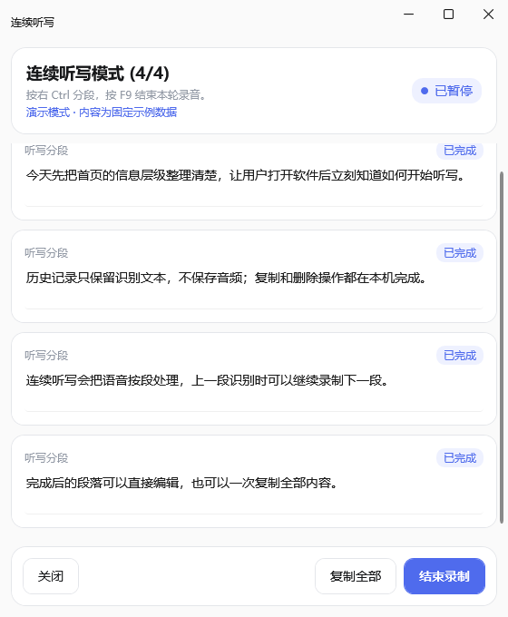

# LessASR

[](https://dotnet.microsoft.com/)
[](https://www.microsoft.com/windows/)
[](LICENSE)

LessASR（代码仓库名仍为 `LocalAsrClient`）是一款 Windows 语音输入 GUI，可由程序托管 [whisper.cpp](https://github.com/ggerganov/whisper.cpp)，也可连接 OpenAI 兼容的 Audio Transcriptions API。程序常驻系统托盘，通过键盘右下角的 Ctrl 键触发听写，识别结果优先直接写入当前文本框；需要整理长段内容时，也可以使用连续听写窗口边说边分段、边识别边编辑。

本项目**由 AI Agent 编码实现**，开发者负责提需求、产品设计、确定业务逻辑与边界条件、验收测试，但通常不直接阅读和修改源码。

## 核心特色

- **本地或远程**：可在托管的本地 whisper.cpp 与多套 OpenAI 兼容 API 配置之间切换。
- **密钥保护**：远程 API Key 可留空；填写后使用当前 Windows 用户的 DPAPI 加密保存。
- **随处输入**：按右 Ctrl 开始和结束单句听写，结果优先写入当前输入框。
- **连续听写**：按 F9 打开专用窗口，使用右 Ctrl 连续分段；上一段识别时可以继续录制下一段。
- **可编辑结果**：连续听写完成的段落可以直接修订，也可以一次复制全部内容。
- **历史与统计分离**：文本历史按保留策略存储；使用统计不包含听写原文，也不会保存音频。
- **场景词汇表**：可为产品名、专业术语等内容建立词汇表，为 Whisper 提供识别提示。

## 界面预览

<table>
  <tr>
    <td width="50%" align="center">
      <br>
      <sub><b>首页</b></sub>
    </td>
    <td width="50%" align="center">
      <br>
      <sub><b>历史记录</b></sub>
    </td>
  </tr>
  <tr>
    <td width="50%" align="center">
      <br>
      <sub><b>本地模型</b></sub>
    </td>
    <td width="50%" align="center">
      <br>
      <sub><b>远程 API</b></sub>
    </td>
  </tr>
  <tr>
    <td width="50%" align="center">
      <br>
      <sub><b>设置</b></sub>
    </td>
    <td width="50%" align="center">
      <br>
      <sub><b>连续听写</b></sub>
    </td>
  </tr>
</table>

## 连续听写

连续听写适合会议纪要、文章草稿和长段思路整理。按 F9 打开窗口后，右 Ctrl 用作句子边界：当前段进入识别队列，同时立即开始下一段录制，因此上一段识别时仍可继续说下一段。完成的段落可以直接编辑或一次复制全部内容；关闭窗口时，已完成内容会按顺序合并为一条历史记录。

## 数据目录

用户数据固定存放在 `%USERPROFILE%\.lessasr\`，不可通过设置修改：

```text
.lessasr/
  data/          # SQLite（client.db）、历史与统计
  logs/          # 应用日志
```

## 快速开始

### 前置条件

- Windows 10/11
- [.NET 8 SDK](https://dotnet.microsoft.com/download/dotnet/8.0)
- 以下识别服务至少准备一种：
  - 本地 `whisper-server` 可执行文件与 Whisper 模型文件；或
  - OpenAI 兼容的 Audio Transcriptions 完整端点，以及提供方要求时使用的 API Key。

### 本地开发

```powershell
dotnet restore LocalAsrClient.sln
dotnet build LocalAsrClient.sln
dotnet test LocalAsrClient.sln
```

### 运行

```powershell
dotnet run --project src/LocalAsrClient.App/LocalAsrClient.App.csproj
```

首次运行可在「模型」页配置本地模型与 `whisper-server` 路径，或添加远程 API。左侧列表固定以本地 Whisper 开头，远程配置会依次列在其后；旧版本用户会继续默认使用本地服务。

### 演示模式

演示模式不依赖麦克风、模型文件或 `whisper-server`。每次启动都会在系统临时目录中从零创建演示数据库，与正式用户数据和自动化测试数据完全隔离：

```powershell
.\tools\Start-LessAsrDemo.ps1
```

重新生成 README 与后续 Wiki 共用的产品截图：

```powershell
.\tools\Update-DocumentationScreenshots.ps1
```

截图统一存放在 `docs/assets/screenshots/`，按内容场景组织，而不是按 README、Wiki 等发布渠道重复保存。

## 构建

```powershell
dotnet build LocalAsrClient.sln -c Release
```

## 测试

```powershell
dotnet test LocalAsrClient.sln
```

Core 层测试无需桌面会话即可运行。

## 部署

```powershell
dotnet publish src/LocalAsrClient.App/LocalAsrClient.App.csproj -c Release -r win-x64 --self-contained false
```

发布产物位于 `src/LocalAsrClient.App/bin/Release/net8.0-windows/win-x64/publish/`。

## 文档

- 架构说明：`docs/architecture.md`
- 业务领域说明：`docs/domain.md`
- 开发约定：`docs/development.md`
- MVP 设计规格：`docs/superpowers/specs/2026-06-07-windows-asr-client-mvp-design.md`
- 识别服务设计：`docs/superpowers/specs/2026-08-15-recognition-services-design.md`
- 本地与远程转写接口：`docs/api.md`
- Agent 工作入口：`AGENTS.md`
